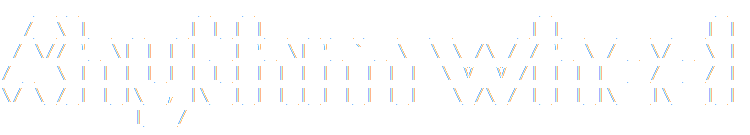
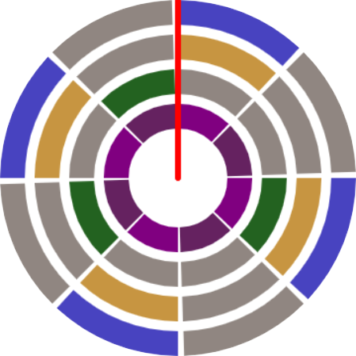
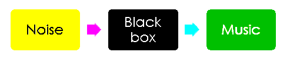

<div id="top"></div>

<!-- PROJECT SHIELDS -->
[![Contributors][contributors-shield]][contributors-url]
[![Forks][forks-shield]][forks-url]
[![Stargazers][stars-shield]][stars-url]
[![Issues][issues-shield]][issues-url]
[![MIT License][license-shield]][license-url]

<!-- PROJECT LOGO -->
<br />
<div align="center">
  <a href="https://github.com/mazamin7/rhythm_wheel">
    
  </a>
  <a href="https://github.com/mazamin7/rhythm_wheel">
    
  </a>
</div>

<h3 align="center">Rhythm Wheel</h3>
  <p align="center">
    An easier way to visualize and represent rhythms<br />
    Give it a try!<br />
    <a href="http://yournotes.altervista.org/"><strong>Hosted website »</strong></a>
    <br />
    <a href="https://github.com/mazamin7/rhythm_wheel"><strong>Explore the docs »</strong></a>
    <br />
    <br />
    <a href="https://www.youtube.com/watch?v=3YUWU_Ernf4">View Demo</a>
    ·
    <a href="https://github.com/mazamin7/rhythm_wheel/issues">Report Bug</a>
    ·
    <a href="https://github.com/mazamin7/rhythm_wheel/issues">Request Feature</a>
  </p>
</h3>

<!-- TABLE OF CONTENTS -->
<details>
  <summary>Table of Contents</summary>
  <ol>
    <li>
      <a href="#about-the-project">About The Project</a>
      <ul>
        <li><a href="#built-with">Built With</a></li>
      </ul>
    </li>
    <li>
      <a href="#getting-started">Getting Started</a>
      <ul>
		<li><a href="#running">Running</a></li>
      </ul>
    </li>
    <li><a href="#usage">Usage</a></li>
		<ul>
		<li><a href="#creating-the-rhythm">Creating the rhythm</a></li>
		<li><a href="#savingloading-on-the-cloud">Saving/loading on the cloud</a></li>
		<li><a href="#generating-a-random-rhythm">Generating a random rhythm</a></li>
      </ul>
    <li><a href="#features">Features</a></li>
	<li><a href="#in-depth-analysis">In-depth analysis</a></li>
	<ul>
		<li><a href="#architecture">Architecture</a></li>
		<li><a href="#polyrhytms">Polyrhytms</a></li>
		<li><a href="#ring-class">Ring class</a></li>
		<li><a href="#environmental-noise-RNG">Environmental noise RNG</a></li>
		<li><a href="#main-subroutines">Main subroutines</a></li>
      </ul>
    <li><a href="#license">License</a></li>
    <li><a href="#contact">Contact</a></li>
  </ol>
</details>


<!-- ABOUT THE PROJECT -->
## About The Project

[](https://www.youtube.com/watch?v=3YUWU_Ernf4)

In this project we have developed a rhythm wheel, that is a drum machine that has a simpler way to represent the rhythm. In fact in standard notation, rhythm is indicated on a musical bar line. This thing most of the time can be hard to visualize and represent; in order to solve this problem we thought of a better way to do the same thing. <br />

We had a simple idea: just as a clock can trace the linear passage of time, the flow of rhythm can be traced in a circle; in this way the rhythm is easier to visualize and it’s easier to represent its repetition through time.<br />

Our main goal is to make the experience of describing a rhythm as effortless as possible!
The user just needs to use the mouse and his creativity.<br />
That’s why we have chosen to restyle the rhythm wheel.
We don’t have dots, but steps, making the web app easier to use with a mouse.<br />


<p align="right">(<a href="#top">back to top</a>)</p>

### Built With

* [Vue.js](https://vuejs.org/)
* [Tone.js](https://tonejs.github.io/)
* [BootstrapVue](https://bootstrap-vue.org/)
* [Firestore](https://firebase.google.com/docs/firestore)

<p align="right">(<a href="#top">back to top</a>)</p>

<!-- GETTING STARTED -->
## Getting Started

### Running

1. Start with cloning this repo on your local machine:
   ```sh
   git clone https://github.com/mazamin7/rhythm_wheel.git
   ```
2. Go to the repository directory
   ```sh
   cd rhythm_wheel
   ```
3. ONLY FIRST BOOT - Install npm
   ```sh
   npm install
   ```
4. Start the server
   ```sh
   npm start
   ```

<p align="right">(<a href="#top">back to top</a>)</p>


<!-- USAGE EXAMPLES -->
## Usage

### Creating the rhythm
In order to fill a step, you have to click once on the desired location.<br/>
There is also the possibility to give the accent to a specific step; in order to do this you have to click once again to mark the step as accented.<br/>
For remove the step you have simplt to click one more time and then it’s removed.<br/>
Another important thing is the fact that with the wheel of the mouse, in combination with the hover of the mouse, is possible to rotate the steps. This is particullary relevant in order to create some irregular rhythms.<br/>
In this brief gif animation you can see how all this process works.<br/><br/>


### Saving/loading on the cloud
The user can store and load his rhythmic patterns, because our application is connected to the cloud; this allows the user to generate a rhythm and then save it in the database, or upload a rhythm that he has created in the last session.<br/>
For doing this we use the Firebase technology, which allows us to make the connection from the application to a NoSql Database stored in the cloud. That makes of course the application stateful.<br/>
In this brief gif animation you can see how all this process works.<br/><br/>


### Generating a random rhythm
One of the functionalities of our app is that it can generate a random rhythm on-the-fly. For doing that the user is required to insert a list of 4 parameters that are used from the algorithm to generate the random polyrhythm. These 4 parameters are:
<ul>
<li>The number of rings that have to be in the polyrhythm</li>
<li>The step filling probability</li>
<li>If the user wants or not to randomize the volume for each ring</li>
<li>If the user wants or not to randomize the phase for each ring (so in practice the rotation of the ring).</li>
</ul>
We can notice that the probability goes from 0 to 1.
In this brief gif animation you can see how it works.

<br/><br/>


<p align="right">(<a href="#top">back to top</a>)</p>

<!-- FEATURES -->
## Features
	
- [✓] Different number of beats/steps for each ring<br/>
- [✓] Support for accents (a step can be stressed or unstressed)<br/>
- [✓] Support for polyrhythms<br/>
- [✓] Ring color is customizable<br/>
- [✓] Instrument selectable by the user<br/>
	- [✓] Big collection of instrument samples<br/>
- [✓] Phase delay controller by the user (steer the ring).<br/>
- [✓] The RPM can be controlled by the user<br/>
- [✓] The volume can be controlled by the user<br/>
- [✓] Rhythmic patterns can be loaded and saved on the cloud<br/>
- [✓] Generation a random pattern<br/>
	- [✓] Generation of random numbers starting from environmental noise<br/>
	
<!-- INDEPTH -->
## In-depth analysis

### Architecture


### Polyrhytms
What is a polyrhythm? A polyrhythm is the simultaneous use of more rhythms that cannot be expressed simply within the same meter. <br/>
Why is our rhythm wheel compatible with polyrhythms? In our rhythm wheel, each wheel can have a different number of steps. <br/>
Why can't I place the steps freely? We didn't want to lose the train of pulses common to other rhythm notations. With our rhythm wheel, you can eat the cake and keep it! <br/>


### Ring class
Our rhythm wheel is an array of rings.<br/>
Each ring is described by the following properties.<br/>
Rhythmic properties:
-Number of steps
-Rhythmic pattern
-Phase
Sound properties:
-Instrument
-Volume
Graphic properties:
-Color

### Environmental noise RNG
Our RNG takes environmental noise as an input  and, after some computations, it outputs a true random number. <br/>
It’s not about safety or privacy, we just wanted to create a connection between noise (random sounds pressure fluctuations) and music (meaningful sounds).<br/>


### Main subroutines
Ring phase delay task:<br/>
-Choose the ring to be rotated with respect to the mouse position<br/>
-Increment the phase of the chosen ring according to the mouse wheel<br/>
<br/>
Clock hand rotation task:<br/>
-Periodically increment degrees (modulo 2π)<br/>
<br/>
Sound play task:<br/>
-For each ring<br/>
	-Convert current degree to step number<br/>
	-If the step is filled, play sound<br/>
<br/>
Draw graphics task:<br/>
-Draw clock hand, rings and steps with Canvas<br/>
<br/>
RNG task:<br/>
-When the pool is not full<br/>
	-Record sound with microphone<br/>
	-Manipulate samples to output a random number<br/>
	-Put the random number in the pool<br/>
<br/>
Database sync task:<br/>
-When the database content changes, update the model<br/>
-When the model changes, update the database<br/>
<br/>
<p align="right">(<a href="#top">back to top</a>)</p>

<!-- LICENSE -->
## License

Distributed under the MIT License. See `LICENSE.txt` for more information.

<p align="right">(<a href="#top">back to top</a>)</p>

<!-- CONTACT -->
## Contact

Alberto Bollino - alberto.bollino@mail.polimi.it<br/>
Gerardo Cicalese - gerardo.cicalese@mail.polimi.it<br/>
Gennaro D'Imperio - gennaro.dimperio@mail.polimi.it<br/>
Giorgio Granello - giorgio.granello@mail.polimi.it<br/>

Project Link: [https://github.com/mazamin7/rhythm_wheel](https://github.com/mazamin7/rhythm_wheel)

<p align="right">(<a href="#top">back to top</a>)</p>

<p align="right">(<a href="#top">back to top</a>)</p>

<!-- MARKDOWN LINKS & IMAGES -->
<!-- https://www.markdownguide.org/basic-syntax/#reference-style-links -->
[contributors-shield]: https://img.shields.io/github/contributors/mazamin7/rhythm_wheel.svg?style=for-the-badge
[contributors-url]: https://github.com/mazamin7/rhythm_wheel/graphs/contributors
[forks-shield]: https://img.shields.io/github/forks/mazamin7/rhythm_wheel.svg?style=for-the-badge
[forks-url]: https://github.com/mazamin7/rhythm_wheel/network/members
[stars-shield]: https://img.shields.io/github/stars/mazamin7/rhythm_wheel.svg?style=for-the-badge
[stars-url]: https://github.com/mazamin7/rhythm_wheel/stargazers
[issues-shield]: https://img.shields.io/github/issues/mazamin7/rhythm_wheel.svg?style=for-the-badge
[issues-url]: https://github.com/mazamin7/rhythm_wheel/issues
[license-shield]: https://img.shields.io/github/license/mazamin7/rhythm_wheel.svg?style=for-the-badge
[license-url]: https://github.com/mazamin7/rhythm_wheel/blob/master/LICENSE.txt
[product-screenshot]: images/screenshot.png
